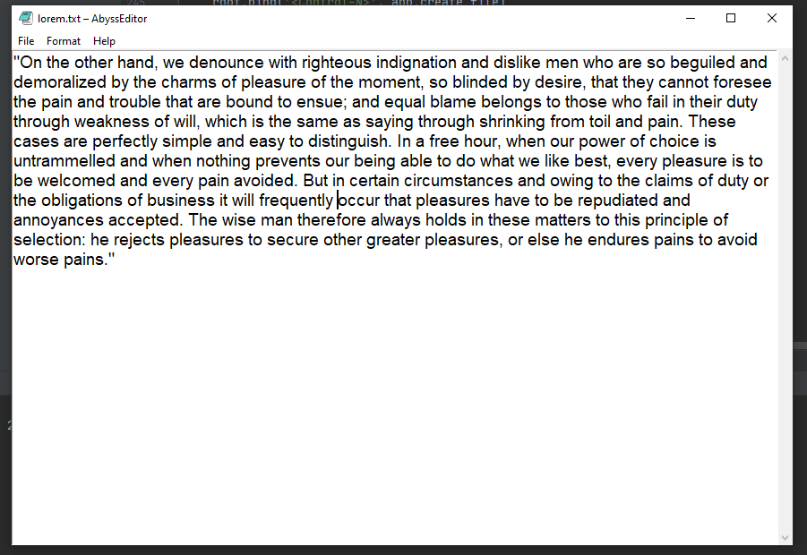

# AbyssEditor
Simple Python editor using tkinter library.

# Installation
Modules in the application are already in the standard **Python library**.
But this version of the app uses:

```Python 3.7+```

```tkinter==8.6```

# Usage
AbyssEditor is a file editor that can:

- Create, open, save files.
- Change family, size font and save these to the config file.



The editor has **Menu bar** which contains **file menu**:


